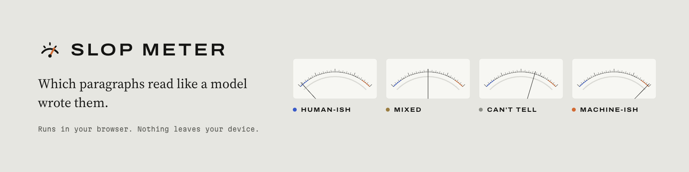

<picture>
  <source media="(prefers-color-scheme: dark)" srcset=".github/assets/readme-dark.png">
  
</picture>

# Slop Meter

Marks text paragraph by paragraph: **human-ish**, **machine-ish**, **mixed** or **can't tell**, with calibrated odds. A 56 KB model runs in the browser, on WebGPU or the CPU, and no text leaves the device. Use it on [slop-meter.com](https://slop-meter.com) or as a Chrome extension.

[models and numbers](https://slop-meter.com/models) · [rulebook](https://slop-meter.com/rules) · [blog](https://slop-meter.com/blog) · [changelog](https://slop-meter.com/changelog) · [install](https://slop-meter.com/install)

## Numbers

| | Standard | Sharper (opt-in) |
|---|---|---|
| Size | 56 KB | 58 KB + SmolLM2-135M, 125 MB once |
| Features per paragraph | 176 | 184 |
| Can't tell, held out (n=11,948) | 91% | 78% |
| Right when it calls | 98.0% | 97.7% |
| Human text called machine-ish | 0.10% | 0.17% |
| Human web pages called machine-ish (n=24,000) | 0.38% | 0.57% |

Full reports are `eval/report.json` and `eval/report-lm.json`.

## Run it

```bash
pnpm install
pnpm check                          # rulebook, format, types, tests, builds, size gate
pnpm --filter @slop/site dev
pnpm --filter @slop/extension e2e   # the extension in real Chromium
```

`.env.local` at the repo root takes `AI_GATEWAY_API_KEY` (rewrite and corpus generation). The site also reads `DATABASE_URL`, `CRON_SECRET` and `REWRITE_MODEL`, all optional.

## Layout

| Path | What |
|---|---|
| `packages/rules` | `rulebook.yaml`: 38 tells with ids and examples |
| `packages/features` | 176 numbers per paragraph: one per rule, plus stylometry |
| `packages/model` | int8 weights, TS forward pass, WGSL kernel |
| `packages/lm` | 8 features from SmolLM2-135M, for sharper reading |
| `packages/theme` | Design tokens |
| `apps/extension` | WXT MV3 extension |
| `apps/site` | Next.js site |
| `training/` | Corpus prep, featurizer, trainer |
| `eval/` | Reports, demo examples, model comparison |

## Retrain

```bash
cd training
uv venv -p 3.12 .venv && uv pip install --python .venv/bin/python torch numpy pyarrow pandas
.venv/bin/python fetch.py            # RAID (12 GB) and C4
# Reddit, Yelp and Wikipedia go in data/human; WildChat and Magpie in data/public
.venv/bin/python prepare.py && node featurize.ts && .venv/bin/python train.py
node featurize-lm.ts && .venv/bin/python train.py --lm     # sharper model, about 45 min
node ../eval/compare-models.ts <old-weights-dir> ../packages/model/weights
```

| Flag | Effect |
|---|---|
| `--seeds N` | Train N runs (default 5) and ship the one that catches the most current-model text |
| `--lm` | Train the sharper model |
| `--ablate r-028` | Train without a feature, write `eval/ablation-r-028.json`, ship nothing |
| `--feedback f.jsonl` | Add opt-in corrections |

A model ships only if its calls are right 96% of the time and it calls at most 0.1% of human validation paragraphs machine-ish (0.2% for sharper).

## Limits

- It says can't tell on 9 paragraphs in 10. That is on purpose.
- Labels come from where the text came from, not from annotators.
- Paraphrased machine text gets through: it catches fewer than 1 paragraph in 10.
- Human text polished by a model is read as human about half the time.
- Text from the newest models mostly gets can't tell.
- English only. Other languages are left unmarked.
- Sharper reading needs WebGPU with 16-bit floats and about 800 MB of memory. A phone that runs out reloads the page, and sharper reading stays off after that.
- Human web text comes from one 2019 crawl.

## License

[AGPL-3.0](LICENSE). The Wikipedia demo text is CC BY-SA 3.0. Every demo text's source is in `eval/examples.json`.
