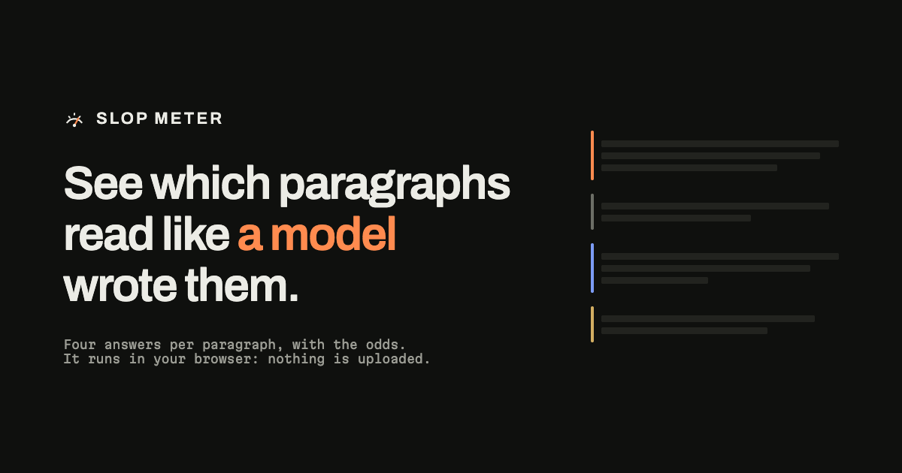

# Slop Meter

Marks text paragraph by paragraph: **human-ish**, **machine-ish**, **mixed** or **can't tell**, with calibrated odds. A 56 KB model runs in the browser on WebGPU, with a CPU fallback, and no text leaves the device.

[slop-meter.com](https://slop-meter.com) · [calibration](https://slop-meter.com/calibration) · [rulebook](https://slop-meter.com/rules) · [install](https://slop-meter.com/install)

## Numbers

| | Standard | Sharper (opt-in) |
|---|---|---|
| Parameters / size | 54,243 / 56 KB | 54,243 + SmolLM2-135M |
| Features per paragraph | 176 | 176 + 8 |
| Can't tell, held out (n=10,239) | 92% | 77% |
| Right when it calls | 97.4% | 97.5% |
| Human text called machine-ish | 0.14% | 0.16% |
| Human web pages called machine-ish (n=3,000) | 0.2% | 0.67% |

Bars are set for 96% right on calls. Full reports: `eval/report.json`, `eval/report-lm.json`, both rendered dated on `/calibration`.

## Run it

```bash
pnpm install
pnpm check                          # rulebook, format, types, tests, TS/WGSL parity, builds, size gate
pnpm --filter @slop/site dev
pnpm --filter @slop/extension e2e   # real Chromium: marks, card, popup, selection, fallback
```

`.env.local` at the repo root: `AI_GATEWAY_API_KEY` for rewrite, corpus generation and the Jev benchmark. Optional for the site: `DATABASE_URL`, `CRON_SECRET`, `REWRITE_MODEL` (default `openai/gpt-4.1-mini`).

## Layout

| Path | What |
|---|---|
| `packages/rules` | `rulebook.yaml`: 38 tells, stable ids, an example each. Validator and learned per-rule weights |
| `packages/features` | One extractor per rule, with spans, plus stylometry. 176 floats per paragraph, frozen spec |
| `packages/model` | int8 weights, TS forward pass, WGSL batch kernel, attribution, shared answer wording |
| `packages/lm` | Sharper reading: 8 features from SmolLM2-135M (ONNX, 4-bit) through transformers.js |
| `packages/theme` | Tokens, Tailwind mapping, answer colors, brand mark |
| `apps/extension` | WXT MV3. Vanilla TS content script; React popup; offscreen page for the language model |
| `apps/site` | Next.js 16, shadcn/ui on Base UI. Demo, rulebook, calibration, install. API routes for rewrite, feedback, calibration snapshots |
| `training/` | Corpus prep, featurizer, PyTorch trainer, int8 export |
| `eval/` | Labeled set, held-out reports, demo examples, Jev benchmark |

## Retrain

```bash
cd training
uv venv -p 3.12 .venv && uv pip install --python .venv/bin/python torch numpy pyarrow pandas
# data/raid: RAID parquet shards. data/human: Reddit, Yelp, Wikipedia. data/public: WildChat,
# Magpie. data/web: C4 en/c4-validation.00000-of-00008.json.gz. See prepare.py
.venv/bin/python prepare.py                        # also writes data/seeds.jsonl
node --env-file=../.env.local generate.ts 2600     # optional, cheap models only
.venv/bin/python prepare.py && node featurize.ts && .venv/bin/python train.py
node featurize-lm.ts && .venv/bin/python train.py --lm   # sharper model, about an hour on an M4 Pro
```

`train.py` writes weights, manifest, per-rule weights and the report; `--lm` writes the sharper pair.

| Flag | Effect |
|---|---|
| `--seeds N` | Train N runs (default 5), ship the one calling the fewest human paragraphs machine-ish on validation |
| `--ablate r-028` | Zero a feature, train, write `eval/ablation-r-028.json`, ship nothing |
| `--feedback f.jsonl` | Add opt-in corrections (vectors and labels, never text) behind a ship gate |

## Limits

- Labels come from provenance, not annotators. "Mixed" means model-polished or spliced text; human edits of model text are not in the corpus.
- It says can't tell on most paragraphs: 9 in 10 held out, 98 in 100 on the web check. Sharper reading brings held out to about 3 in 4.
- Weakest on model-polished human text, whose top guess is human 43% of the time, and on paraphrased machine text, a coin flip.
- Institutional policy statements lean machine-ish. Across 2,788 Federal Register paragraphs, 13.8% lean machine and 0.3% are called machine-ish, so formal prose on its own is fine. The Federal Reserve statement on the site leans machine on 2 of its 3 paragraphs.
- Text from current models mostly gets can't tell. Short posts and replies lean machine; long essays lean either way.
- Text written as one element with blank lines between paragraphs is marked run by run, drawn in an overlay. Those lamps are the tab stop, since a run has no element of its own to focus.
- Sharper reading needs WebGPU with 16-bit floats. The language model downloads once, about 120 MB, and adds roughly 800 MB to the tab while it runs.
- Human web prose comes from one C4 shard (3,000 pages, 2019). RAID's parquet mirror covers 4 of its 8 domains.
- English only.

## License

[AGPL-3.0](LICENSE). Demo texts carry their own terms: the Thoreau and Federal Reserve examples are public domain, the Wikipedia example is CC BY-SA 3.0 and names its revision, and the model-written examples record the model, date and prompt in `eval/examples.json`.
